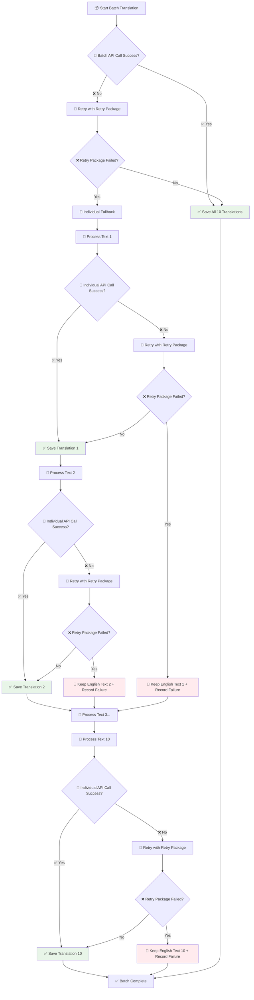

# Fallback Strategy: Batch → Individual → English

## Visual Flow Chart

```mermaid
flowchart TD
    A[📦 Start Batch Translation] --> B{🤖 Batch API Call Success?}

    B -->|✅ Yes| C[✅ Save All 10 Translations]
    B -->|❌ No| D[🔄 Retry with Retry Package]

    D --> D1{❌ Retry Package Failed?}
    D1 -->|Yes| E[🔄 Individual Fallback]
    D1 -->|No| C

    E --> F[📝 Process Text 1]
    F --> G{🤖 Individual API Call Success?}
    G -->|✅ Yes| H[✅ Save Translation 1]
    G -->|❌ No| I[🔄 Retry with Retry Package]

    I --> I1{❌ Retry Package Failed?}
    I1 -->|Yes| J[🔄 Keep English Text 1 + Record Failure]
    I1 -->|No| H

    H --> K[📝 Process Text 2]
    K --> L{🤖 Individual API Call Success?}
    L -->|✅ Yes| M[✅ Save Translation 2]
    L -->|❌ No| N[🔄 Retry with Retry Package]

    N --> N1{❌ Retry Package Failed?}
    N1 -->|Yes| O[🔄 Keep English Text 2 + Record Failure]
    N1 -->|No| M

    M --> P[📝 Process Text 3...]
    O --> P
    J --> P

    P --> Q[📝 Process Text 10]
    Q --> R{🤖 Individual API Call Success?}
    R -->|✅ Yes| S[✅ Save Translation 10]
    R -->|❌ No| T[🔄 Retry with Retry Package]

    T --> T1{❌ Retry Package Failed?}
    T1 -->|Yes| U[🔄 Keep English Text 10 + Record Failure]
    T1 -->|No| S

    S --> V[✅ Batch Complete]
    U --> V
    C --> V

    style C fill:#e8f5e8
    style H fill:#e8f5e8
    style M fill:#e8f5e8
    style S fill:#e8f5e8
    style J fill:#ffebee
    style O fill:#ffebee
    style U fill:#ffebee
```
