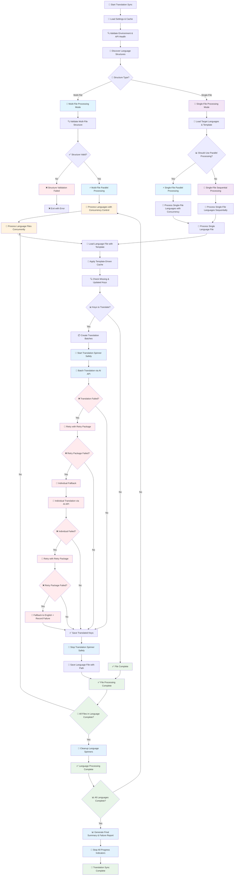

# Multi-File Translation Workflow in Translation Sync System

## Flow Chart

```mermaid
flowchart TD
    A[🚀 Start Translation Sync] --> B[📁 Load Settings & Cache]
    B --> C[🔍 Validate Environment & API Health]
    C --> D[📂 Discover Language Structures]

    D --> E{📁 Structure Type?}
    E -->|Multi-File| F[📁 Multi-File Processing Mode]
    E -->|Single-File| G[📄 Single-File Processing Mode]

    F --> H[🔍 Validate Multi-File Structure]
    H --> I{✅ Structure Valid?}
    I -->|No| J[❌ Structure Validation Failed]
    I -->|Yes| K[⚡ Multi-File Parallel Processing]

    G --> L[📄 Load Target Languages & Template]
    L --> M{📊 Should Use Parallel Processing?}
    M -->|Yes| N[⚡ Single-File Parallel Processing]
    M -->|No| O[🔄 Single-File Sequential Processing]

    K --> P[🔄 Process Languages with Concurrency Control]
    P --> Q[📁 Process Language Files Concurrently]
    Q --> R[📄 Load Language File with Template]
    R --> S[💾 Apply Template-Driven Cache]
    S --> T[🔍 Check Missing & Updated Keys]
    T --> U{📊 Keys to Translate?}

    U -->|Yes| V[📦 Create Translation Batches]
    U -->|No| W[✅ File Complete]

    V --> X[🔄 Start Translation Spinner Safely]
    X --> Y[🤖 Batch Translation via AI API]
    Y --> Z{❌ Translation Failed?}

    Z -->|Yes| AA[🔄 Retry with Retry Package]
    Z -->|No| BB[✅ Save Translated Keys]

    AA --> CC{❌ Retry Package Failed?}
    CC -->|Yes| DD[🔄 Individual Fallback]
    CC -->|No| BB

    DD --> EE[🤖 Individual Translation via AI API]
    EE --> FF{❌ Individual Failed?}

    FF -->|Yes| GG[🔄 Retry with Retry Package]
    FF -->|No| BB

    GG --> HH{❌ Retry Package Failed?}
    HH -->|Yes| II[🔄 Fallback to English + Record Failure]
    HH -->|No| BB

    II --> BB
    BB --> JJ[🔄 Stop Translation Spinner Safely]
    JJ --> KK[💾 Save Language File with Path]
    KK --> LL[✅ File Processing Complete]

    W --> LL
    LL --> MM{📁 All Files in Language Complete?}
    MM -->|No| Q
    MM -->|Yes| NN[🔄 Cleanup Language Spinners]
    NN --> OO[✅ Language Processing Complete]

    OO --> PP{📊 All Languages Complete?}
    PP -->|No| P
    PP -->|Yes| QQ[📊 Generate Final Summary & Failure Report]
    QQ --> RR[🔄 Stop All Progress Indicators]
    RR --> SS[🎉 Translation Sync Complete]

    N --> TT[🔄 Process Single-File Languages with Concurrency]
    O --> UU[🔄 Process Single-File Languages Sequentially]
    TT --> VV[📄 Process Single Language File]
    UU --> VV
    VV --> R

    J --> WW[❌ Exit with Error]

    style F fill:#e1f5fe
    style G fill:#f3e5f5
    style K fill:#e1f5fe
    style N fill:#e1f5fe
    style O fill:#f3e5f5
    style P fill:#fff3e0
    style Q fill:#fff3e0
    style W fill:#e8f5e8
    style X fill:#e3f2fd
    style Y fill:#e3f2fd
    style Z fill:#ffebee
    style AA fill:#ffebee
    style CC fill:#ffebee
    style DD fill:#ffebee
    style EE fill:#ffebee
    style FF fill:#ffebee
    style GG fill:#ffebee
    style HH fill:#ffebee
    style II fill:#ffebee
    style JJ fill:#e3f2fd
    style LL fill:#e8f5e8
    style MM fill:#e8f5e8
    style NN fill:#e3f2fd
    style OO fill:#e8f5e8
    style PP fill:#e8f5e8
    style QQ fill:#e3f2fd
    style RR fill:#e3f2fd
    style SS fill:#e8f5e8
    style J fill:#ffebee
```
