# Multi-File Translation Workflow in Translation Sync System

## Overview

The translation system now supports both single-file and multi-file structures with automatic detection, concurrent processing, intelligent template matching, and updated keys handling.

## Updated Keys Feature

The system now supports marking keys as updated in template files using `__updated_keys__` arrays. When a key is marked as updated, it will be re-translated in all target language files, even if it already exists.

### Usage Example

```json
{
  "hero": {
    "title": "Welcome to Our Platform",
    "subtitle": "The best solution for your needs",
    "cta": "Get Started",
    "__updated_keys__": ["title"]
  }
}
```

In this example, the `title` key will be re-translated in all target language files, even if it already exists, because it's marked in the `__updated_keys__` array.

## Flow Chart

```mermaid
flowchart TD
    A[🚀 Start Translation Sync] --> B[📁 Load Settings & Cache]
    B --> C[🔍 Validate Environment & API Health]
    C --> D[📂 Discover Language Structures]

    D --> E{📁 Structure Type?}
    E -->|Multi-File| F[📁 Multi-File Processing Mode]
    E -->|Single-File| G[📄 Single-File Processing Mode]

    F --> H[🔍 Validate Multi-File Structure]
    H --> I{✅ Structure Valid?}
    I -->|No| J[❌ Structure Validation Failed]
    I -->|Yes| K[⚡ Multi-File Parallel Processing]

    G --> L[📄 Load Target Languages & Template]
    L --> M{📊 Should Use Parallel Processing?}
    M -->|Yes| N[⚡ Single-File Parallel Processing]
    M -->|No| O[🔄 Single-File Sequential Processing]

    K --> P[🔄 Process Languages with Concurrency Control]
    P --> Q[📁 Process Language Files Concurrently]
    Q --> R[📄 Load Language File with Template]
    R --> S[💾 Apply Cached Translations]
    S --> T[🔍 Check Missing & Updated Keys]
    T --> U{📊 Keys to Translate?}

    U -->|Yes| V[📦 Create Translation Batches]
    U -->|No| W[✅ File Complete]

    V --> X[🤖 Batch Translation via AI API]
    X --> Y{❌ Translation Failed?}

    Y -->|Yes| Z[🔄 Retry with Retry Package]
    Y -->|No| AA[✅ Save Translated Keys]

    Z --> Z1{❌ Retry Package Failed?}
    Z1 -->|Yes| Z2[🔄 Individual Fallback]
    Z1 -->|No| AA

    Z2 --> BB[🤖 Individual Translation via AI API]
    BB --> CC{❌ Individual Failed?}

    CC -->|Yes| DD[🔄 Retry with Retry Package]
    CC -->|No| AA

    DD --> DD1{❌ Retry Package Failed?}
    DD1 -->|Yes| EE[🔄 Fallback to English + Record Failure]
    DD1 -->|No| AA

    EE --> AA
    AA --> FF[💾 Save Language File with Path]
    FF --> GG[✅ File Processing Complete]

    W --> GG
    GG --> HH{📁 All Files in Language Complete?}
    HH -->|No| Q
    HH -->|Yes| II[✅ Language Processing Complete]

    II --> JJ{📊 All Languages Complete?}
    JJ -->|No| P
    JJ -->|Yes| KK[📊 Generate Final Summary & Failure Report]
    KK --> LL[🎉 Translation Sync Complete]

    N --> MM[🔄 Process Single-File Languages with Concurrency]
    O --> NN[🔄 Process Single-File Languages Sequentially]
    MM --> OO[📄 Process Single Language File]
    NN --> OO
    OO --> R

    J --> PP[❌ Exit with Error]

    style F fill:#e1f5fe
    style G fill:#f3e5f5
    style K fill:#e1f5fe
    style N fill:#e1f5fe
    style O fill:#f3e5f5
    style P fill:#fff3e0
    style Q fill:#fff3e0
    style W fill:#e8f5e8
    style Y fill:#ffebee
    style Y2 fill:#ffebee
    style CC fill:#ffebee
    style DD fill:#ffebee
    style JJ fill:#e8f5e8
    style J fill:#ffebee
```


