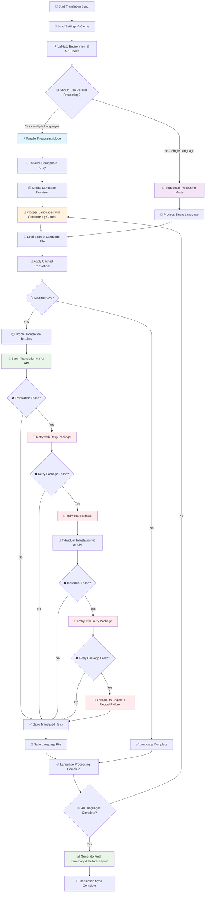

# Parallel Processing Workflow in Translation Sync System

## Flow Chart

```mermaid
flowchart TD
    A[🚀 Start Translation Sync] --> B[📁 Load Settings & Cache]
    B --> C[🔍 Validate Environment & API Health]
    C --> D{📊 Should Use Parallel Processing?}

    D -->|Yes - Multiple Languages| E[⚡ Parallel Processing Mode]
    D -->|No - Single Language| F[🔄 Sequential Processing Mode]

    E --> G[🎯 Initialize Semaphore Array]
    G --> H[📦 Create Language Promises]
    H --> I[🔄 Process Languages with Concurrency Control]

    I --> J[📄 Load a target Language File]
    J --> K[💾 Apply Cached Translations]
    K --> L{🔍 Missing Keys?}

    L -->|Yes| M[📦 Create Translation Batches]
    L -->|No| N[✅ Language Complete]

    M --> O[🤖 Batch Translation via AI API]
    O --> P{❌ Translation Failed?}

    P -->|Yes| Q[🔄 Retry with Retry Package]
    P -->|No| R[✅ Save Translated Keys]

    Q --> Q1{❌ Retry Package Failed?}
    Q1 -->|Yes| Q2[🔄 Individual Fallback]
    Q1 -->|No| R

    Q2 --> S[🤖 Individual Translation via AI API]
    S --> T{❌ Individual Failed?}

    T -->|Yes| U[🔄 Retry with Retry Package]
    T -->|No| R

    U --> U1{❌ Retry Package Failed?}
    U1 -->|Yes| V[🔄 Fallback to English + Record Failure]
    U1 -->|No| R

    V --> R
    R --> W[💾 Save Language File]
    W --> X[✅ Language Processing Complete]

    N --> X
    X --> Y{📊 All Languages Complete?}

    Y -->|No| I
    Y -->|Yes| Z[📊 Generate Final Summary & Failure Report]
    Z --> AA[🎉 Translation Sync Complete]

    F --> BB[📄 Process Single Language]
    BB --> J

    style E fill:#e1f5fe
    style F fill:#f3e5f5
    style I fill:#fff3e0
    style O fill:#e8f5e8
    style Q fill:#ffebee
    style Q2 fill:#ffebee
    style U fill:#ffebee
    style V fill:#ffebee
    style Z fill:#e8f5e8
```
