# Multi-File Translation Workflow in Translation Sync System

## Overview

The translation system now supports both single-file and multi-file structures with automatic detection, concurrent processing, intelligent template matching, updated keys handling, and robust progress tracking with proper cleanup.

## Key Features

### Updated Keys Feature

The system supports marking keys as updated in template files using `__updated_keys__` arrays. When a key is marked as updated, it will be re-translated in all target language files, even if it already exists.

### Progress Tracking & Spinner Management

- **Multi-level Progress Tracking**: Language-level, batch-level, and translation-level progress indicators
- **Spinner Cleanup**: Automatic cleanup of translation spinners to prevent stuck progress indicators
- **Concurrent Processing**: Parallel processing with semaphore-based concurrency control
- **Template-Driven Cache**: Cache application follows template structure for systematic processing

### Usage Example

```json
{
  "hero": {
    "title": "Welcome to Our Platform",
    "subtitle": "The best solution for your needs",
    "cta": "Get Started",
    "__updated_keys__": ["title"]
  }
}
```

In this example, the `title` key will be re-translated in all target language files, even if it already exists, because it's marked in the `__updated_keys__` array.

## Flow Chart

```mermaid
flowchart TD
    A[🚀 Start Translation Sync] --> B[📁 Load Settings & Cache]
    B --> C[🔍 Validate Environment & API Health]
    C --> D[📂 Discover Language Structures]

    D --> E{📁 Structure Type?}
    E -->|Multi-File| F[📁 Multi-File Processing Mode]
    E -->|Single-File| G[📄 Single-File Processing Mode]

    F --> H[🔍 Validate Multi-File Structure]
    H --> I{✅ Structure Valid?}
    I -->|No| J[❌ Structure Validation Failed]
    I -->|Yes| K[⚡ Multi-File Parallel Processing]

    G --> L[📄 Load Target Languages & Template]
    L --> M{📊 Should Use Parallel Processing?}
    M -->|Yes| N[⚡ Single-File Parallel Processing]
    M -->|No| O[🔄 Single-File Sequential Processing]

    K --> P[🔄 Process Languages with Concurrency Control]
    P --> Q[📁 Process Language Files Concurrently]
    Q --> R[📄 Load Language File with Template]
    R --> S[💾 Apply Template-Driven Cache]
    S --> T[🔍 Check Missing & Updated Keys]
    T --> U{📊 Keys to Translate?}

    U -->|Yes| V[📦 Create Translation Batches]
    U -->|No| W[✅ File Complete]

    V --> X[🔄 Start Translation Spinner]
    X --> Y[🤖 Batch Translation via AI API]
    Y --> Z{❌ Translation Failed?}

    Z -->|Yes| AA[🔄 Retry with Retry Package]
    Z -->|No| BB[✅ Save Translated Keys]

    AA --> CC{❌ Retry Package Failed?}
    CC -->|Yes| DD[🔄 Individual Fallback]
    CC -->|No| BB

    DD --> EE[🤖 Individual Translation via AI API]
    EE --> FF{❌ Individual Failed?}

    FF -->|Yes| GG[🔄 Retry with Retry Package]
    FF -->|No| BB

    GG --> HH{❌ Retry Package Failed?}
    HH -->|Yes| II[🔄 Fallback to English + Record Failure]
    HH -->|No| BB

    II --> BB
    BB --> JJ[🔄 Stop Translation Spinner]
    JJ --> KK[💾 Save Language File with Path]
    KK --> LL[✅ File Processing Complete]

    W --> LL
    LL --> MM{📁 All Files in Language Complete?}
    MM -->|No| Q
    MM -->|Yes| NN[✅ Language Processing Complete]

    NN --> OO{📊 All Languages Complete?}
    OO -->|No| P
    OO -->|Yes| PP[📊 Generate Final Summary & Failure Report]
    PP --> QQ[🔄 Stop All Progress Indicators]
    QQ --> RR[🎉 Translation Sync Complete]

    N --> SS[🔄 Process Single-File Languages with Concurrency]
    O --> TT[🔄 Process Single-File Languages Sequentially]
    SS --> UU[📄 Process Single Language File]
    TT --> UU
    UU --> R

    J --> VV[❌ Exit with Error]

    style F fill:#e1f5fe
    style G fill:#f3e5f5
    style K fill:#e1f5fe
    style N fill:#e1f5fe
    style O fill:#f3e5f5
    style P fill:#fff3e0
    style Q fill:#fff3e0
    style W fill:#e8f5e8
    style X fill:#e3f2fd
    style Y fill:#e3f2fd
    style Z fill:#ffebee
    style AA fill:#ffebee
    style CC fill:#ffebee
    style DD fill:#ffebee
    style EE fill:#ffebee
    style FF fill:#ffebee
    style GG fill:#ffebee
    style HH fill:#ffebee
    style II fill:#ffebee
    style JJ fill:#e3f2fd
    style LL fill:#e8f5e8
    style MM fill:#e8f5e8
    style NN fill:#e8f5e8
    style OO fill:#e8f5e8
    style QQ fill:#e3f2fd
    style RR fill:#e8f5e8
    style J fill:#ffebee
```



## Technical Implementation Details

### Progress Tracking System

The system uses a multi-layered progress tracking approach:

1. **Language Progress Bar**: Tracks overall progress across all languages
2. **Batch Progress Bar**: Tracks progress within each language file's batches
3. **Translation Spinner**: Shows real-time status of individual translation operations

### Spinner Management & Cleanup

- **Automatic Cleanup**: All spinners are automatically stopped at the end of each language file processing
- **Error Handling**: Spinners are properly cleaned up even when errors occur using `finally` blocks
- **Multi-Language Support**: Prevents stuck spinners when processing multiple languages in parallel

### Concurrency Control

- **Semaphore-Based**: Uses semaphores to control concurrent processing
- **Configurable Limits**: Maximum concurrent languages and files can be configured
- **Resource Management**: Prevents overwhelming the AI API with too many concurrent requests

### Cache System

- **Template-Driven**: Cache application follows the template structure systematically
- **Key Validation**: Ensures all template keys are processed and missing translations are identified
- **Performance Optimization**: Reduces redundant API calls by reusing cached translations

### Error Handling & Fallback Strategy

1. **Batch Translation**: Primary method for efficiency
2. **Retry Mechanism**: Automatic retry with exponential backoff
3. **Individual Fallback**: Falls back to individual translations if batch fails
4. **English Fallback**: Uses English text as last resort and records failures

### Supported AI Models

- **OpenAI**: GPT-4o, GPT-4o Mini, GPT-4.1
- **Anthropic**: Claude 3.5 Sonnet, Claude 3 Haiku
- **Google**: Gemini 2.5 Flash

### Performance Optimizations

- **Parallel Processing**: Concurrent language and file processing
- **Batch Translation**: Groups multiple keys for efficient API usage
- **Rate Limiting**: Configurable delays between batches
- **Memory Management**: Efficient handling of large translation files
