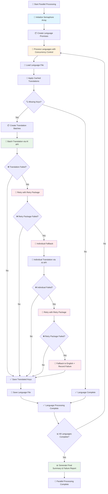

# Semaphore-Based Concurrency Control Visualization

## Visual Representation

```mermaid
flowchart TD
    A[🚀 Start Parallel Processing] --> B[🎯 Initialize Semaphore Array]
    B --> C[📦 Create Language Promises]
    C --> D[🔄 Process Languages with Concurrency Control]

    D --> E[📄 Load Language File]
    E --> F[💾 Apply Cached Translations]
    F --> G{🔍 Missing Keys?}

    G -->|Yes| H[📦 Create Translation Batches]
    G -->|No| I[✅ Language Complete]

    H --> J[🤖 Batch Translation via AI API]
    J --> K{❌ Translation Failed?}

    K -->|Yes| L[🔄 Retry with Retry Package]
    K -->|No| M[✅ Save Translated Keys]

    L --> L1{❌ Retry Package Failed?}
    L1 -->|Yes| N[🔄 Individual Fallback]
    L1 -->|No| M

    N --> O[🤖 Individual Translation via AI API]
    O --> P{❌ Individual Failed?}

    P -->|Yes| Q[🔄 Retry with Retry Package]
    P -->|No| M

    Q --> Q1{❌ Retry Package Failed?}
    Q1 -->|Yes| R[🔄 Fallback to English + Record Failure]
    Q1 -->|No| M

    R --> M
    M --> S[💾 Save Language File]
    S --> T[✅ Language Processing Complete]

    I --> T
    T --> U{📊 All Languages Complete?}

    U -->|No| D
    U -->|Yes| V[📊 Generate Final Summary & Failure Report]
    V --> W[🎉 Parallel Processing Complete]

    style B fill:#e1f5fe
    style D fill:#fff3e0
    style J fill:#e8f5e8
    style L fill:#ffebee
    style N fill:#ffebee
    style Q fill:#ffebee
    style R fill:#ffebee
    style V fill:#e8f5e8
```
