# Template-Driven Cache Application Workflow

## New Workflow Overview

The cache application has been refactored to follow a **template-driven approach** instead of the previous cache-driven approach. This ensures that all template keys are processed systematically and missing translations are properly identified.

## Flow Chart

```mermaid
flowchart TD
    A[📄 Load Template Language File] --> B[🔍 Parse Template JSON Content]
    B --> C[📋 Extract All Template Keys]
    C --> D[💾 Load Translation Cache]

    D --> E{❓ Cache File Exists?}
    E -->|No| F[🆕 Create Empty Cache]
    E -->|Yes| G[📖 Read Cache Data]

    F --> H[🚫 No Cached Translations Available]
    G --> I[🔍 Check Cache Validity]

    I --> J{❓ Cache is Valid?}
    J -->|No| K[🗑️ Clear Invalid Cache]
    J -->|Yes| L[✅ Cache Ready for Use]

    K --> F
    H --> M[⏭️ Skip to Translation Phase]
    L --> N[🔄 Iterate Through Template Keys]

    N --> O[📝 Get Key A from Template]
    O --> P[🔍 Get Key A Value from Template]
    P --> Q[💾 Check Cache for valueA_langcode]

    Q --> R{❓ Translation Exists in Cache?}
    R -->|Yes| S[✅ Apply Cached Translation to Key A]
    R -->|No| T[📝 Mark Key A as Missing Translation]

    S --> U[✅ Translation Applied Successfully]
    T --> V[📊 Track Missing Translation]

    U --> W{❓ More Template Keys?}
    V --> W

    W -->|Yes| N
    W -->|No| X[📊 Generate Cache Application Summary]

    X --> Y[💾 Save Updated Target Language File]
    Y --> Z[✅ Template-Driven Cache Application Complete]

    M --> Z

    style A fill:#e3f2fd
    style C fill:#e3f2fd
    style O fill:#e3f2fd
    style P fill:#e3f2fd
    style D fill:#e8f5e8
    style G fill:#e8f5e8
    style L fill:#e8f5e8
    style S fill:#e8f5e8
    style U fill:#e8f5e8
    style Z fill:#e8f5e8
    style H fill:#fff3e0
    style T fill:#fff3e0
    style V fill:#fff3e0
    style M fill:#fff3e0
```

